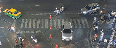
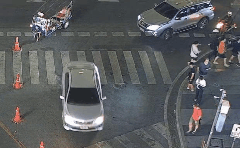
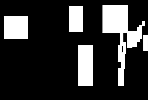
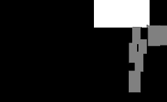

# Bangkok Intersection Dataset for Illegal Action Detection
This is the code for
**'How to Detect Non-yielding Actions of Vehicles?  A Challenging Dataset with Strong Baseline'.**

# Overview

&nbsp;&nbsp;&nbsp;&nbsp;· We introduce a public dataset for detecting vehicles that fail to yield to pedestrians. This dataset, the first of its kind, captures real traffic scenes at two zebra crossings at a Bangkok intersection and includes 10 hours of video containing 1972 instances of violations.

&nbsp;&nbsp;&nbsp;&nbsp;· We offer a new approach for understanding vehicle non-yielding behavior in surveillance videos. The filtering strategy transforms the task of detecting violations in complex scenes into recognizing violation actions within specific spatiotemporal regions of interest.

## Bangkok Intersection Dataset

2024.08.11 The [dataset](https://pan.baidu.com/s/1d2cyQVXj8Kc964-4tjYk4g?pwd=mn2s) and [annotations](https://pan.baidu.com/s/1aoJLJUT-A7H4jO1Luzsp9w?pwd=6l8r) are currently available for download.

2024.07.23 The preprocessed mid-level features are currently available for [download](#download-feature-table).

## Our Method

The overall process of this work is illustrated in <strong><a href="#figure1">Figure 1</a></strong>.

<strong><a href="#figure2">Figure 2</a></strong> visualizes the features (snippets) of different preprocessing stages.

<strong><a href="#table1">Table 1</a></strong> shows the different stages and their corresponding download links.

It is recommended to download **trajectory-related** snippets for quick reproduction.

  

  <em><strong>Figure 1. Our framework.</strong></em>

 

  
  &nbsp;&nbsp;&nbsp;&nbsp;
  

 

  
  &nbsp;&nbsp;&nbsp;&nbsp;
  
  &nbsp;&nbsp;&nbsp;&nbsp;
  

 

  <em><strong>Figure 2. Feature preprocessing visualization.</strong> For details on the specific stages of preprocessing, please refer to <strong><a href="#table1">Table 1</a></strong>.</em>

 
 

  <em>The first row are video snippets. Left: Stage #1. Right: Stage #2.</em>

  
 

  <em>The second row are trajectory snippets. Left: Stage #3. Middle: Stage #4. Right: Stage #5.</em>

  

  <em><strong>Table 1. Preprocessing stage.</strong> For details on feature preprocessing visualization, please refer to <strong><a href="#figure2">Figure 2</a></strong>.</em>

 
  

  <em>Method indicates the preprocessing scheme used. RBTF represents the region-based trajectories filtering operation, BR indicates background removal strategy, IVE means irrelevant vehicle elimination approach.</em>

 

  <table id="download-feature-table">
    <tr>
      <th>Stage</th>
      <th>Modality</th>
      <th>Method</th>
      <th>Download</th>
      <th>File(rar)</th>
    </tr>
    <tr>
      <td>#1</td>
      <td>Video</td>
      <td>None</td>
      <td><a href="https://pan.baidu.com/s/1fPxTRJlmCoPldaAI4bjjxA?pwd=btxe">Baidu Cloud</a></td>
      <td>rgb_features</td>
    </tr>
    <tr>
      <td>#2</td>
      <td>Video</td>
      <td>RBTF</td>
      <td><a href="https://pan.baidu.com/s/1JVXRf5kXREh3a1REQBJwUQ?pwd=m4r4">Baidu Cloud</a></td>
      <td>rgb_volumes_region</td>
    </tr>
    <tr>
      <td>#3</td>
      <td>Trajectory</td>
      <td>BR</td>
      <td><a href="https://pan.baidu.com/s/19fNUNXKMrWR-E5vOMNY2Og?pwd=kueg">Baidu Cloud</a></td>
      <td>tra_features</td>
    </tr>
    <tr>
      <td>#4</td>
      <td>Trajectory</td>
      <td>RBTF+BR</td>
      <td><a href="https://pan.baidu.com/s/1_pXS_LDc4hPn03LPwgrEkw?pwd=06lp">Baidu Cloud</a></td>
      <td>tra_volumes_region</td>
    </tr>
    <tr>
      <td>#5</td>
      <td>Trajectory</td>
      <td>RBTF+BR+IVE</td>
      <td><a href="https://pan.baidu.com/s/13Dpw9sfgvsDdlwnGUtXGgw?pwd=1esm">Baidu Cloud</a></td>
      <td>tra_att_volumes_region</td>
    </tr>
  </table>

# Pretrained Detector

To accurately detect objects of interest in traffic scenes, we use YOLOv8-m for pre-training on additional annotated datasets.

We recommend using the provided datasets for object detector training or utilizing the trained model parameters.

This additional [auxiliary dataset](https://app.roboflow.com/nnu-hi7if/nnu_intersection/7) is used to train the object detector.

Please install the environment according to the official website of [Ultralytics YOLOv8](https://github.com/ultralytics/ultralytics/blob/main/README.md).

# Prepeocessing Method

# Acknowledgments

We would like to express our sincere gratitude to the following individuals and groups for their invaluable assistance in this work:

&nbsp;&nbsp;&nbsp;&nbsp;· The person in charge of the YouTube live broadcast platform for permitting data collection.

&nbsp;&nbsp;&nbsp;&nbsp;· The officers in Nanjing Transport for their meticulous annotation of the dataset.

&nbsp;&nbsp;&nbsp;&nbsp;· Potential contributors, including reviewers and researchers, for their interest and input in this work.

# Contact

Any questions, feel free to contact me via email: `zeshenghu@njnu.edu.cn`
