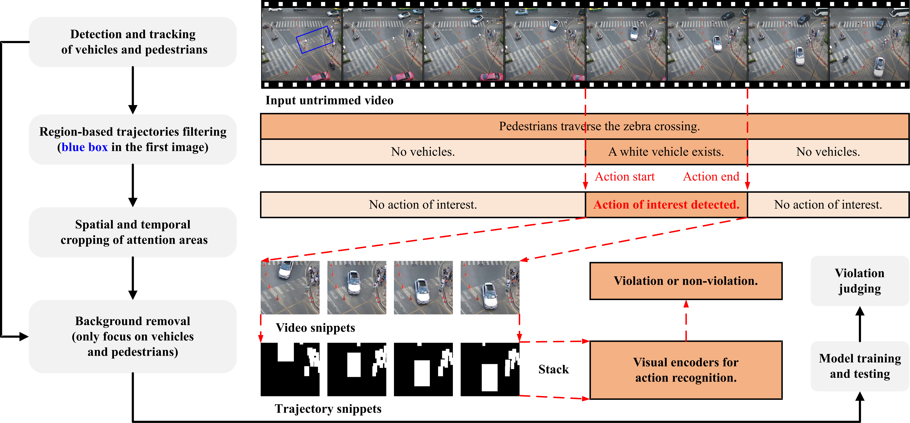
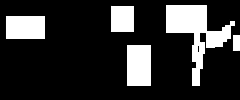

# The Crosswalk Dataset for Illegal Action Detection
This is the code for
**'How to Detect Non-yielding Actions of Vehicles?  A Challenging Dataset with Strong Baseline'.**

# Overview

- We introduce a public dataset for detecting vehicles that fail to yield to pedestrians. This dataset, the first of its kind, captures real traffic scenes at two zebra crossings at a Bangkok intersection and includes 10 hours of video containing 1972 instances of violations.

- We offer a new approach for understanding vehicle non-yielding behavior in surveillance videos. The filtering strategy transforms the task of detecting violations in complex scenes into recognizing violation actions within specific spatiotemporal regions of interest.

**The current versions are all available for download from Baidu Netdisk.**

## The Crosswalk Dataset

- *Sep 3, 2024*

Some important data is already available for download from **Google Drive**.

- *Aug 12, 2024*

The **[labels](https://pan.baidu.com/s/17_Zi4dSVOLou5N1yRG0Ilw?pwd=4o9a)** for training and testing are publicly available.

&nbsp;&nbsp;&nbsp;&nbsp; See more details about the [labels](#evaluation-criteria).

- *Aug 11, 2024*

The **dataset** (52GB) and **annotations** are currently available for download.

&nbsp;&nbsp;&nbsp;&nbsp; See more details about the [dataset](#dataset-introduction) and [annotations](#dataset-annotations).

We will *make the dataset fully available for download after the manuscript is accepted*. Now you can reproduce our method in two ways:

-- Download a video (514MB) from the dataset and continue. You can download the data through [Baidu Disk](https://pan.baidu.com/s/1KAySJ_DNrKo6M6l0_Si7nw?pwd=cpgd) or [Google Drive](https://drive.google.com/file/d/16By0jyQPQsdZpp_oTwgnEppsrpBTTYox/view?usp=drive_link).

-- You can **directly download our preprocessed data for reproduction**.

- *Jul 23, 2024*

The **[preprocessed features](#download-feature-table)** are currently available for download.

&nbsp;&nbsp;&nbsp;&nbsp; It is recommended to download the features of **stage #5** first for quick reproduction.

### Dataset Introduction

 This dataset originates from continuous 24-hour live-streams of a specific intersection in Bangkok, captured from a fixed overhead perspective on **[YouTube](https://www.youtube.com/watch?v=qisHraYNXYI)**.
 
 It consists of 10 hours of footage, divided into 120 untrimmed videos, recorded between November 2023 and March 2024.
 
 Video numbers range from *video_001* to *video_120*. All videos are five minutes long.
 
 These videos feature the same traffic scene under various weather conditions and times of day.
 
 Focusing on two pedestrian crosswalks, the dataset captures vehicles moving bidirectionally, entering and exiting the frame via the left and right boundaries.
 
 To reduce extraneous background activity, the recordings were confined to areas of interest, yielding a final video resolution of 1200×1100 pixels at 30 fps.

### Dataset Annotations

You can download the data through [Baidu Disk](https://pan.baidu.com/s/1aoJLJUT-A7H4jO1Luzsp9w?pwd=6l8r) or [Google Drive](https://drive.google.com/file/d/1pKrevRdrWC7-hDcp8O-jYVJMv-YMPayW/view?usp=sharing).

This work focuses on identifying instances where vehicles fail to yield to pedestrians. We provide detailed annotations for each vehicle that violates the rules, including its spatiotemporal information as it enters and exits the crosswalk area.

The annotations are stored in JSON files, generated using LabelMe, where the file names correspond to the frame numbers at which the violations occur. For instance, if a vehicle enters the area of interest at frame 1301 and leaves at frame 1501, and fails to yield to pedestrians during this time, two JSON files will be created: 00001300.json and 00001500.json. 

Each JSON file contains two key data, namely *points* and *group_id*.

The bounding box coordinates are recorded under *points*, capturing the vehicle's location as it enters and exits the crosswalk. The bounding box coordinates of the vehicle in the form of *(top left x, top left y, bottom right x, bottom right y)*.

*group_id* uniquely identifies the vehicle within the annotated area, distinguishing it from other vehicles. Note that if a vehicle violates the rules at two separate crosswalks, there will be four corresponding JSON files, each associated with two different group_ids.

Convert spatiotemporal annotations in json format to txt text. Run:

`python json_to_txt.py`

It is recommended to **put these files in a folder as follows**, and you can also **modify the path**.

        -annotations\
          -video_001\
            -00000291.json
            -00000377.json
            ...
          -video_002
          ...
          -video_120
        -json_to_txt.py

For a certain violation of a certain vehicle, the format of the txt file is:

        -group_id
        -How many times (all 2)
        -1 / Number of frames entering the zebra crossing area / (all 0) / Bounding box when entering the zebra crossing
        -2 / Number of frames leaving the zebra crossing area / (all 0) / Bounding box when leaving the zebra crossing

### Evaluation Criteria

To evaluate the model's generalization and robustness, we designed two distinct cross-validation benchmarks: *cross-video* and *cross-scene*.

- *Cross-video evaluation.* We sequentially numbered 120 video segments, with snippets from odd-numbered videos used for training and even-numbered for testing. This method evaluates the model's ability to generalize across diverse video sequences.

- *Cross-scene evaluation.* Under this benchmark, events from the upper zebra crossing areas were assigned to the training dataset, while events from the lower areas were allocated to testing. This approach assesses the model's capability to recognize violations across varied traffic scenarios.

We generated labels by performing spatiotemporal matching based on the annotations. 

Snippets were extracted centered on areas where vehicles entered and exited while pedestrians passed by, resulting in 1972 snippets featuring vehicle infractions and 5752 featuring non-violating vehicles. Note that both types of snippets may contain multiple vehicles, some of which are not offending. This setup reflects real traffic complexities, challenging the model to distinguish and classify the main offending vehicle in each snippet accurately. We categorize the 1972 snippets as *positive samples* and the remaining 5752 as *negative samples*.

The generated snippets consist of 32 downsampled images, named using the format **V**xxx**I**xxxxx**S**x**D**x**R**x**A**x (where x represents a number).

Let's take **V001I00002S1D0R0A1** as an example to explain the naming convention:

- **V** indicates the video number. For example, **V001** refers to video_001.
- **I** denotes the tracking number of the target. **I00002** means that the vehicle's tracking ID is 2.
- **S** stands for the scene number. **S1** represents the lower pedestrian crossing area, while **S0** indicates the upper zebra crossing area.
- **D** specifies the vehicle's direction, indicating whether it is moving up or down, i.e., driving on the left or right side of the lane. In Thailand, vehicles typically drive on the left; **D0** represents down (right), and **D1** represents up (left).
- **R** shows whether data augmentation was applied. In this case, all samples are **R0**, indicating no data enhancement.
- **A** indicates whether the action is legal or illegal. **A0** denotes a violation, while **A1** indicates compliance.

### Dataset Preparation

We divide the video into frames, which is also an important pre-step for subsequent preprocessing.

`pip install video-cli`

Take video_001 as an example and divide it into frames:

`video-toimg train_001.avi`

## Our Method

The overall process of this work is illustrated in <strong><a href="#figure1">Figure 1</a></strong>.

<strong><a href="#figure2">Figure 2</a></strong> visualizes the features (snippets) of different preprocessing stages.

<strong><a href="#table1">Table 1</a></strong> shows the different stages and their corresponding download links.

  

  <em><strong>Figure 1. Our framework.</strong></em>

 

  
  &nbsp;&nbsp;&nbsp;&nbsp;
  

 

  
  &nbsp;&nbsp;&nbsp;&nbsp;
  
  &nbsp;&nbsp;&nbsp;&nbsp;
  

 

  <em><strong>Figure 2. Feature preprocessing visualization.</strong> For details on the specific stages of preprocessing, please refer to <strong><a href="#table1">Table 1</a></strong>.</em>

 
 

  <em>The first row are video snippets. Left: Stage #1. Right: Stage #2.</em>

  
 

  <em>The second row are trajectory snippets. Left: Stage #3. Middle: Stage #4. Right: Stage #5.</em>

  

  <em><strong>Table 1. Preprocessing stage.</strong> For details on feature preprocessing visualization, please refer to <strong><a href="#figure2">Figure 2</a></strong>.</em>

 
  

  <em>Method indicates the preprocessing scheme used. RBTF represents the region-based trajectories filtering operation, BR indicates background removal strategy, IVE means irrelevant vehicle elimination approach.</em>

 

  <table id="download-feature-table">
    <tr>
      <th>Stage</th>
      <th>Modality</th>
      <th>Method</th>
      <th>Download</th>
      <th>File(rar)</th>
      <th>Size</th>
    </tr>
    <tr>
      <td>#1</td>
      <td>Video</td>
      <td>None</td>
      <td><a href="https://pan.baidu.com/s/1fPxTRJlmCoPldaAI4bjjxA?pwd=btxe">Baidu Disk</a></td>
      <td>rgb_features</td>
      <td>31.4GB</td>
    </tr>
    <tr>
      <td>#2</td>
      <td>Video</td>
      <td>RBTF</td>
      <td><a href="https://pan.baidu.com/s/1JVXRf5kXREh3a1REQBJwUQ?pwd=m4r4">Baidu Disk</a></td>
      <td>rgb_volumes_region</td>
      <td>11.9GB</td>
    </tr>
    <tr>
      <td>#3</td>
      <td>Trajectory</td>
      <td>BR</td>
      <td><a href="https://pan.baidu.com/s/19fNUNXKMrWR-E5vOMNY2Og?pwd=kueg">Baidu Disk</a></td>
      <td>tra_features</td>
      <td>974MB</td>
    </tr>
    <tr>
      <td>#4</td>
      <td>Trajectory</td>
      <td>RBTF+BR</td>
      <td><a href="https://pan.baidu.com/s/1_pXS_LDc4hPn03LPwgrEkw?pwd=06lp">Baidu Disk</a></td>
      <td>tra_volumes_region</td>
      <td>522MB</td>
    </tr>
    <tr>
      <td>#5</td>
      <td>Trajectory</td>
      <td>RBTF+BR+IVE</td>
      <td>
       <a href="https://pan.baidu.com/s/13Dpw9sfgvsDdlwnGUtXGgw?pwd=1esm">Baidu Disk</a>
       <a href="https://drive.google.com/file/d/1gZCSWD1AC2dtdrcC1bP3U5KqjTvPZ1sX/view?usp=sharing">Google Drive</a>
      </td>
      <td>tra_att_volumes_region</td>
      <td>410MB</td>
    </tr>
  </table>

# Pretrained Detector

To accurately detect objects of interest in traffic scenes, we use YOLOv8-m for pre-training on additional annotated datasets.

We recommend using the provided datasets for object detector training or utilizing the trained model parameters.

This additional [auxiliary dataset](https://app.roboflow.com/nnu-hi7if/nnu_intersection/7) is used to train the object detector.

Please install the environment according to the official website of [Ultralytics YOLOv8](https://github.com/ultralytics/ultralytics/blob/main/README.md).

All models were trained on an RTX 4090. You can use our **pretrained weights** or train the model yourself.

You can download the weights through [Baidu Disk](https://pan.baidu.com/s/1XhjA8IiR8zNuU3blHsymEQ?pwd=z8fl) or [Google Drive](https://drive.google.com/drive/folders/1fPra_scgzv_RP1yKMQ83HdyWiVFyeYkc?usp=sharing).

Training a detector from scratch：

`yolo task=detect mode=train model=yolov8m.pt data=intersection_images/data.yaml epochs=100 imgsz=640`

YOLOv8 has five variants: -n, -s, -m, -l, -x. The "model" parameter can be modified to specify the variant to use.

We recommend using -m as it achieves better results on auxiliary datasets.

# Prepeocessing Method

The overall steps include:

- **Object detection and tracking**
  
  Track vehicles and pedestrians and obtain trajectory data.

- **Region-based trajectory filtering**

  Filter vehicles and pedestrians of interest based on trajectories and predefined areas.

- **Background removal and irrelevant vehicle elimination**

  According to the trajectory data, the foreground is retained and the background is eliminated.

  The irrelevant vehicle elimination strategy only keep pedestrians and key vehicles to construct more refined trajectory features.

To demonstrate the output at each step, we have prepared separate Python files corresponding to nearly every stage of the process. You can *follow them sequentially* or *download our preprocessed files* for quick reproduction.

## Step 1: Object Detection and Tracking

You can **skip this step** by downloading the **tracking data** (430MB) we preprocessed earlier.

You can download the tracking data through [Baidu Disk](https://pan.baidu.com/s/1niuto7cPNf1DqRzpr8h0LQ?pwd=teou) or [Google Drive](https://drive.google.com/file/d/1rwJ9bXvbW7czSOqD_2WHxHweK7PadzZF/view?usp=sharing).

Make sure you have **downloaded the dataset and pretrained weights**.

In addition, the **[operating environment](#pretrained-detector)** of YOLOv8 also needs to be configured.

It is recommended to **put these files in a folder as follows**, and you can also **modify the path**.

        -intersection-video\  
          -video_001.avi  
          -video_002.avi
          ...
          -video_120.avi
        -detector_weight\  
          -m\          
            -weights\
              -best.pt
        -tracking.py

Next, the YOLOv8 interface is called to sequentially process the video, outputting the trajectories obtained through object tracking.

`python tracking.py`

The program takes several hours to run completely. You will get the following in the same file:

        -intersection-video
        -detector_weight
        -tracking.py
        -tracking_output\  
          -video_001.txt  
          -video_002.txt
          ...
          -video_120.txt

These txt files contain the raw tracking data.

## Step 2: Region-based Trajectory Filtering

This step processes the original trajectory data in **three stages**:

- *Stage 1:* Filter the original trajectory to identify the vehicle IDs of interest.

To reproduce, run

`python filtering_1.py`

You can **skip this step** by downloading the **data** (62MB) we preprocessed earlier.

You can download the data through [Baidu Disk](https://pan.baidu.com/s/1NY9l_OWqlPoGjJXLiPhoCQ?pwd=lq1p) or [Google Drive](https://drive.google.com/file/d/1dbJPFLjdewRFxvqY_KOMwKh-FoD4wBnn/view?usp=sharing).

- *Stage 2:* Using the vehicle IDs identified in Stage 1, determine the time when each vehicle enters and exits the crosswalk.

To reproduce, run

`python filtering_2.py`

You can **skip this step** by downloading the **data** (65MB) we preprocessed earlier.

You can download the data through [Baidu Disk](https://pan.baidu.com/s/1ANqBnCyIplW-DCj-e2f9gw?pwd=pit3) or [Google Drive](https://drive.google.com/file/d/1rBsdkhpgCxxTE-xbToJRY7jkWnFSdUND/view?usp=sharing).

- *Stage 3:* Generates the detection value in txt format. Its format is similar to the ground truth:

        -track_id
        -How many times (all 2)
        -1 / Number of frames entering the zebra crossing area / (all 0) / Bounding box when entering the zebra crossing
        -2 / Number of frames leaving the zebra crossing area / (all 0) / Bounding box when leaving the zebra crossing

To reproduce, run

`python filtering_3.py`

You can **skip this step** by downloading the **data** (610KB) we preprocessed earlier.

You can download the data through [Baidu Disk](https://pan.baidu.com/s/1pSkRGPJDVL0-rX19NRC33A?pwd=n0lk) or [Google Drive](https://drive.google.com/file/d/1JCwaziKEMoWawvzuc8Oy2M0VPM7wy9OX/view?usp=sharing).

It is recommended to **put these files in a folder as follows**, and you can also **modify the path**.

        -tracking_output\  
          -video_001.txt  
          -video_002.txt
          ...
          -video_120.txt
        -filtering_1.py
        -filtering_2.py
        -filtering_3.py

        -filtering_output\  # after running filtering_1.py
          -video_001_bot.txt
          -video_001_top.txt
          ...
          -video_120_bot.txt
          -video_120_top.txt

        -filtering_woatt_output\  # after running filtering_2.py
          -video_001_woatt_bot.txt
          -video_001_woatt_top.txt
          ...
          -video_120_woatt_bot.txt
          -video_120_woatt_top.txt
          
         -filtering_woatt_summary\  # after running filtering_3.py
          -video_001_woatt_bot.txt
          -video_001_woatt_top.txt
          ...
          -video_120_woatt_bot.txt
          -video_120_woatt_top.txt

## Step 3: Background Removal and Irrelevant Vehicle Elimination

We provide **two** background removal methods.

- *The first method (**optional**)* retains all pedestrians and vehicles in the foreground. It can generate features for stages #2 and #4. 

To reproduce, run

`python background_removal.py`

You can **skip this step** by downloading the [data](https://pan.baidu.com/s/1OH9VxMA-QNmtbhcKStf3kQ?pwd=agnk) (5GB) we preprocessed earlier.

After completing the above operations, perform spatiotemporal cropping to obtain the feature files of stages #2 and #4. 

(**optional**) To reproduce, run

`python preprocessing_region.py`

You can **skip this step** by downloading the [rgb features](https://pan.baidu.com/s/1JVXRf5kXREh3a1REQBJwUQ?pwd=m4r4) (11.9GB) or [trajectory features](https://pan.baidu.com/s/1_pXS_LDc4hPn03LPwgrEkw?pwd=06lp) (522MB) we preprocessed earlier.

It is recommended to **put these files in a folder as follows**, and you can also **modify the path**.

        -tracking_output\  
          -video_001.txt  
          -video_002.txt
          ...
          -video_120.txt
        -background_removal.py        #  optional
        -preprocessing_region.py         #  optional
        
        -generated_images\  # after running background_removal.py   (optional)
          -video_001\
            -00000000.jpg
            -00000001.jpg
            ...
            -00008999.jpg
          -video_002
          ...
          -video_120
        -rgb_volumes_region  # after running reprocessing_region.py   (optional)
        -tra_volumes_region  # after running reprocessing_region.py   (optional)

- *The second method* retains only pedestrians and subsequently adds key vehicles to remove irrelevant vehicles. It can generate features for stage #5.

To reproduce, run

`python background_removal_att.py`

You can **skip this step** by downloading the **data** (3GB) we preprocessed earlier.

You can download the data through [Baidu Disk](https://pan.baidu.com/s/1KOMPo5z3BxNEmknNRjhccg?pwd=h0a1) or [Google Drive](https://drive.google.com/file/d/1XtTEBXPn_PMUlBVZx58V1vZ59Or9xaFD/view?usp=sharing).

After completing the above operations, perform spatiotemporal cropping to obtain the feature files of stage #5.
        
To reproduce, run

`python preprocessing_region_att.py`

You can **skip this step** by downloading the **refined features** (410MB) we preprocessed earlier.

You can download the data through [Baidu Disk](https://pan.baidu.com/s/13Dpw9sfgvsDdlwnGUtXGgw?pwd=1esm) or [Google Drive](https://drive.google.com/file/d/1gZCSWD1AC2dtdrcC1bP3U5KqjTvPZ1sX/view?usp=sharing).

It is recommended to **put these files in a folder as follows**, and you can also **modify the path**.

        -tracking_output\  
          -video_001.txt  
          -video_002.txt
          ...
          -video_120.txt
        -background_removal_att.py
        -preprocessing_region_att.py

        -generated_ped_images\  # after running background_removal_att.py
          -video_001\
            -00000000.jpg
            -00000001.jpg
            ...
            -00008999.jpg
          -video_002
          ...
          -video_120
        -tra_att_volumes_region  # after running preprocessing_region_att.py

# Model training and testing

After completing the preprocessing, the main program can be called for training and testing.

It is recommended to **put these files in a folder as follows**, and you can also **modify the path**.

        -main.py
        -dataset_reader.py
        -model_s3d_tra.py           # Call the model and give it arguments
        -model
        -label

        -tra_att_volumes_region     # Recommended
        -rgb_volumes_region         # Optional
        -tra_volumes_region         # Optional
        ...

To reproduce, run

`python main.py`

You can also modify the parameters to call other models for training and testing.

You can use the [S3D](https://pan.baidu.com/s/1kbTvNPA72R6Dj3z_VtK1cg?pwd=nyfo) model (60.8M) we have trained for testing.

# Acknowledgments

We would like to express our sincere gratitude to the following individuals and groups for their invaluable assistance in this work:

&nbsp;&nbsp;&nbsp;&nbsp;· The person in charge of the YouTube live broadcast platform for permitting data collection.

&nbsp;&nbsp;&nbsp;&nbsp;· The officers in Nanjing Transport for their meticulous annotation of the dataset.

&nbsp;&nbsp;&nbsp;&nbsp;· Potential contributors, including reviewers and researchers, for their interest and input in this work.

# Contact

Any questions, feel free to contact me via email: `zeshenghu@njnu.edu.cn`
